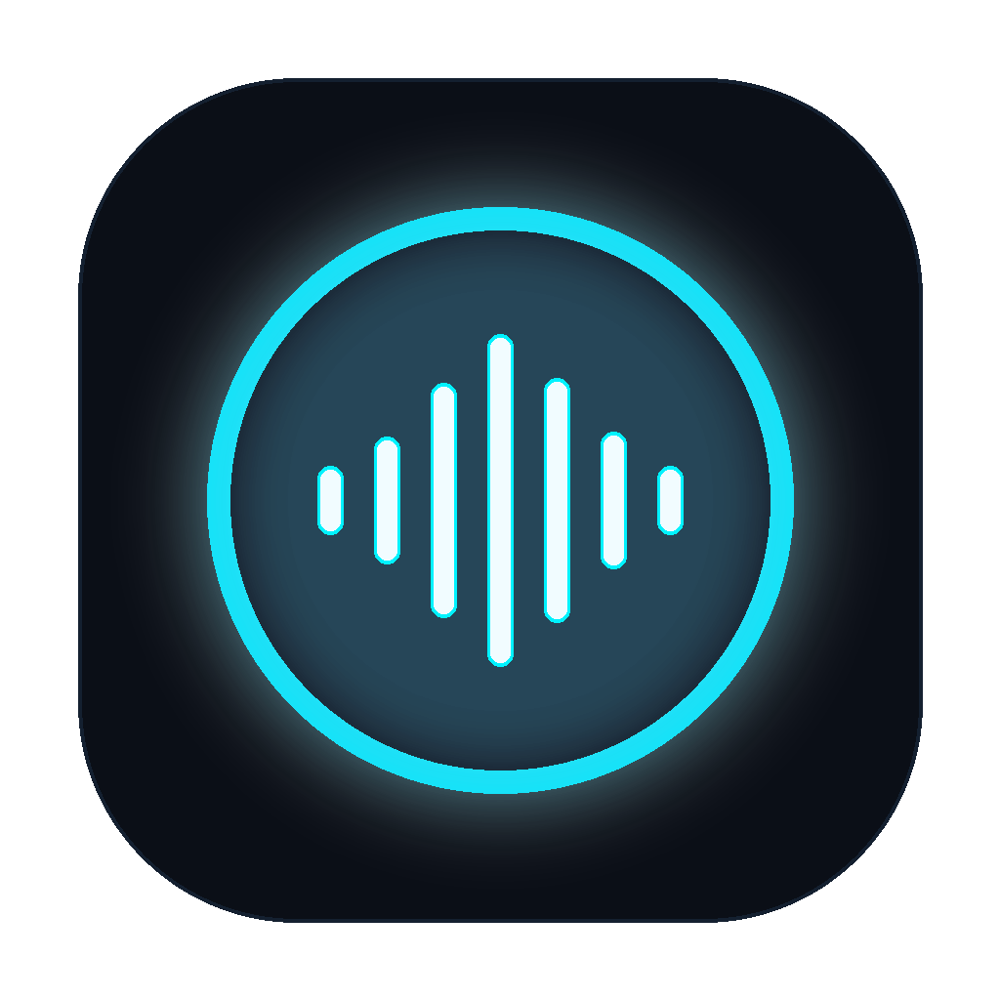
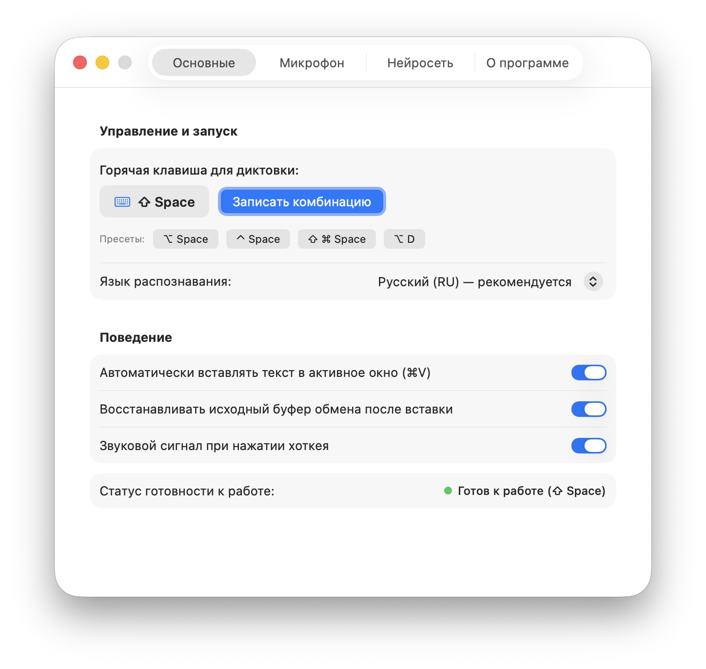
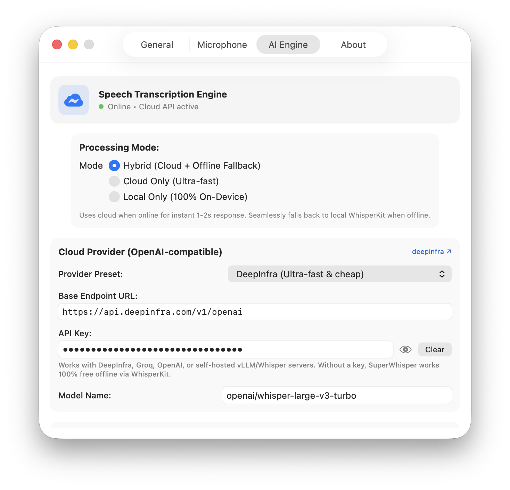

# 🎙️ SuperWhisper

<p align="center">
  
</p>

<p align="center">
  <strong>Smart voice dictation with a Liquid Glass HUD and hybrid AI transcription for macOS.</strong><br>
  <em>Instant cloud inference via DeepInfra, Groq, or OpenAI — with seamless 100% offline WhisperKit fallback.</em>
</p>

<p align="center">
  <a href="#-quick-install-single-command">Quick Install</a> •
  <a href="#-features">Features</a> •
  <a href="#-cloud-providers--open-ai-compatibility">Cloud Providers</a> •
  <a href="#-local-on-device-models">Local Models</a> •
  <a href="#-русская-версия">Русская версия</a>
</p>

<p align="center">
  
  
  
  
  
</p>

<p align="center">
  
</p>

---

## ⚡️ Quick Install (Single Command)

Install and launch SuperWhisper in **one single command**:

```bash
curl -fsSL https://raw.githubusercontent.com/1nickzakharov-glitch/SuperWhisper/main/install.sh | bash
```

*This automatically compiles the optimized release binary, signs it, installs it to `/Applications/SuperWhisper.app`, and launches it immediately.*

---

## ✨ Features

- **⚡️ Universal Hybrid Architecture (Cloud + Offline)**:
  - **Online**: Blazing fast transcription in **1–2 seconds** for 2–4 minutes of continuous speech via GPU-accelerated cloud APIs (**DeepInfra**, **Groq**, **OpenAI**, or self-hosted vLLM). No CPU heating or battery drain.
  - **Offline**: Automatically and seamlessly falls back to local **WhisperKit** running on Apple Silicon Neural Engine / Metal GPU when internet is unavailable (e.g. on flights, subways, or off-grid).
- **🌊 Liquid Glass Floating HUD**:
  - Translucent Apple VisionOS-inspired floating capsule with frosted material that adapts to both light and dark windows.
  - 60 FPS procedural equalizer with a natural voice dome, alternating bar rhythms, and traveling ripples.
- **⌨️ Instant Trigger & Auto-Paste (`Cmd+V`)**:
  - Press `⌥ Space` (Option + Space) anywhere. Speak your mind. Press `⌥ Space` again.
  - SuperWhisper automatically pastes the formatted transcription straight into your active app (Telegram, browser, terminal, Slack, Obsidian, IDE, Notes).
  - Preserves your existing clipboard content automatically.
- **🌐 Multilingual & Intelligent Punctuation**:
  - Full support for Russian, English, Spanish, German, French, Chinese, Japanese, and more.
  - Smart punctuation formatting: commas before conjunctions, capitalization, and automatic filtering of repetitive subtitle hallucinations (*"To be continued..."* / *"Продолжение следует..."*).
- **🔒 Privacy-First**:
  - No telemetry, analytics, or background tracking. Your API keys and preferences are stored exclusively on your Mac in `UserDefaults`.

---

## 📸 Screenshots

<p align="center">
  
  
</p>

---

## ☁️ Cloud Providers & OpenAI Compatibility

SuperWhisper works **100% free offline out of the box**. To unlock 1–2 second instant cloud speeds on long recordings, you can connect any OpenAI-compatible audio endpoint in **Settings → AI Engine**:

| Provider | Model | Latency | Approx. Cost |
| :--- | :--- | :--- | :--- |
| **[DeepInfra](https://deepinfra.com)** | `openai/whisper-large-v3-turbo` | ~1.2s | ~$0.0003 / min (~$0.02 / hr) |
| **[Groq](https://console.groq.com)** | `whisper-large-v3-turbo` | ~0.8s | Free tier / ~$0.04 / hr |
| **[OpenAI](https://platform.openai.com)** | `whisper-1` | ~2.5s | $0.006 / min |
| **Self-Hosted** | Local Whisper / vLLM / Ollama | Local | Free |

*You can also specify any custom Base URL (`http://localhost:8000/v1` or custom proxy) and custom model name.*

---

## 💻 Local On-Device Models (WhisperKit)

For completely private, offline transcription, choose your preferred CoreML model in **Settings → AI Engine**:
- **Large-v3-Turbo** (598 MB) — Highest accuracy, handles complex Russian/English grammar.
- **Small** (460 MB) — Great balance of speed and accuracy for 8 GB RAM machines.
- **Base** (140 MB) — Fast and lightweight.
- **Tiny** (75 MB) — Instant startup and minimal memory footprint.

---

## 🛠 Usage & Controls

- `⌥ Space` (Option + Space) — Start / Stop dictation (customizable in settings).
- **HUD Hover Controls**:
  - `✕` Cancel recording without pasting.
  - `⏸` / `▶` Pause or resume recording.
  - `✓` Finish and auto-paste text.
- **Menu Bar Icon**: Access status, settings, or quit.

---

## 🇷🇺 Русская версия

**SuperWhisper** — умная персональная диктовка с интерфейсом Liquid Glass и гибридным AI-движком для macOS:

- **Быстрая установка одной командой**:
  ```bash
  curl -fsSL https://raw.githubusercontent.com/1nickzakharov-glitch/SuperWhisper/main/install.sh | bash
  ```
- **Гибридный режим**: мгновенное облачное распознавание за 1–2 секунды через DeepInfra, Groq или OpenAI, с автоматическим бесшовным переключением на локальный **WhisperKit** при отсутствии интернета.
- **Стеклянный оверлей Liquid Glass**: 60 FPS адаптивная капсула с волновым эквалайзером, откликающимся на естественный голос.
- **Авто-вставка (`Cmd+V`)**: автоматическая вставка надиктованного текста в любое активное окно без лишних кликов.
- **Язык интерфейса**: переключение между English и Русским прямо в настройках.

---

## 📄 License

Distributed under the **MIT License**. See [LICENSE](LICENSE) for details.
